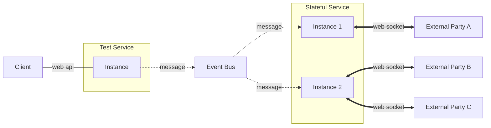

# Message Communication with Stateful Service

This project showcases different approaches of message communication between a stateless service and some instances of a stateful service.

The following diagram shows the relationship among the different components in this demonstration. The `Client` and `External Parties` are not included in the docker compose file.

